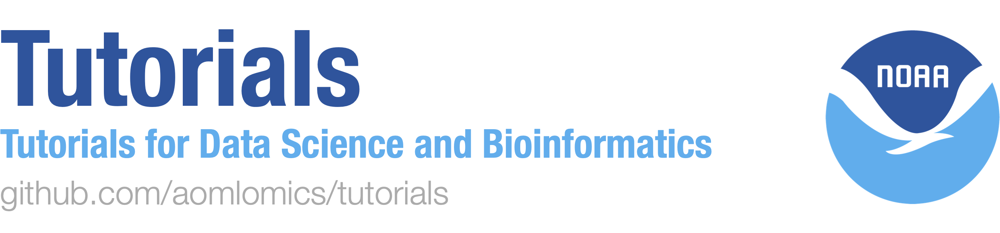

# Tutorials

This repository contains tutorials and crash courses for common computing environments, programs, or languages that are useful for data science.

Current tutorials available are:

* [Command Line](https://github.com/cuttlefishh/tutorials/tree/master/command-line)
* [Git and GitHub](https://github.com/cuttlefishh/tutorials/tree/master/github)
* [Python](https://github.com/cuttlefishh/tutorials/tree/master/python)
* [Data Wrangling](https://github.com/cuttlefishh/tutorials/tree/master/data-wrangling)
* [QIIME 2](https://github.com/cuttlefishh/tutorials/tree/master/qiime2)
* [Snakemake](https://github.com/cuttlefishh/tutorials/tree/master/snakemake)
* [Docker](https://github.com/aomlomics/tutorials/tree/master/docker)

## Getting started

To run these tutorials locally on your machine, you can download the files individually. Or simply clone the whole repository using `git clone`, as follows.

First you might want to create a directory where your Git repositories can live:

```
mkdir ~/git
cd ~/git
```

Then use `git clone` to make a local copy on your computer:

```
git clone https://github.com/aomlomics/tutorials.git
```

Now you have all the files in this repository. You can change them if you want, and even request for those changes to be incorporated into the repository using a "pull request" through GitHub.
