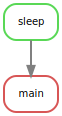
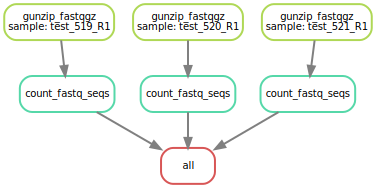

## Snakemake Tutorial

### Introductory Slideshow

[Snakemake In Short](https://slides.com/johanneskoester/snakemake-short#/) from Snakemake creator Johannes Koester.

### Installation

Install Snakemake in your environment of choice using Conda:

```
conda install -c bioconda snakemake
```

Or, if also installing Tourmaline, install Snakemake by following the instructions at https://github.com/cuttlefishh/tourmaline#installation. Remember to activate your Conda environment before installing or running Snakemake.

To make a local copy of this README.md file and the examles, create a working directory to work in, then clone the whole Tutorials repository as follows:

```
mkdir ~/workshop-2019.11
cd ~/workshop-2019.11
git clone https://github.com/cuttlefishh/tutorials.git
```

### Examples

Files for the examples below are found in the corresponding directories (`example1`, `example2`, etc.) of the `snakemake` directory of the Tutorials repository.

#### Example 1

This example uses a target rule "main" at the top and a normal rule "mytask". We learn about **command variations**, **target files**, and **target rules**.

##### Snakefile

```
rule main:
    input:
        "out.txt"

rule mytask:
    output:
        "out.txt"
    shell:
        "echo 'Some text' > {output}"
```

Let's say we want to create an output file `out.txt` that contains some text from an echo command. Each of the four Snakemake commands below will generate the same output file `out.txt`:

```
# specify the desired file as the target
snakemake out.txt
```

```
# specify the rule that creates the desired file as the target
snakemake mytask
```

```
# specify the default target rule as the target
snakemake main
```

```
# let the default target rule be the target
snakemake
```

Snakemake considers the first rule of the workflow the default target. Therefore, we can create a rule at the top that takes as input all the files we want to be output by the workflow.

##### Output

```
$ snakemake
Building DAG of jobs...
Using shell: /bin/bash
Provided cores: 1
Rules claiming more threads will be scaled down.
Job counts:
	count	jobs
	1	main
	1	mytask
	2

[Sun Nov 17 19:24:49 2019]
rule mytask:
    output: out.txt
    jobid: 1

[Sun Nov 17 19:24:49 2019]
Finished job 1.
1 of 2 steps (50%) done

[Sun Nov 17 19:24:49 2019]
localrule main:
    input: out.txt
    jobid: 0

[Sun Nov 17 19:24:49 2019]
Finished job 0.
2 of 2 steps (100%) done
Complete log: /Users/luke/git/tutorials/snakemake/example1/.snakemake/log/2019-11-17T192449.781643.snakemake.log
```

#### Example 2

This example introduces the use of an **input file** and **parameters**. We'll also learn about options for dry run and directed acyclic graph (DAG).

##### Snakefile

```
rule main:
    input:
        "out.txt"

rule sleep:
    params:
        lines=2
    input:
        "in.txt"
    output:
        "out.txt"
    shell:
        "head -n {params.lines} {input} > {output}"
```

The input file `in.txt` contains 5 lines of text. Let's say we want to print the first 2 lines of that file to `out.txt`. Any of the variant Snakemake commands we used above will work, but let's just specify the top target rule as our target:

```
snakemake main
```

If we wanted to see what rules would be run without running them, we could do a **dry run**:

```
snakemake --dryrun main
```

Here are some other versions of dry run, using single-letter parameters, with the first rule as default target:

```
# dry run (-n), print shell commands (-p)
snakemake -n -p
```

```
# dry run (-n), print execution reason for each job (-r)
snakemake -n -r
```

To see the graphical representation of the rules, inputs, and outputs, we can create a **directed acyclic graph (DAG)**. To generate the DAG, we use the `dot` command that comes with Snakemake to create and SVG file:

```
snakemake --dag main | dot -Tsvg > dag.svg
```

A copy of this DAG is stored in directory `dags` of this repository:



##### Output

```
$ snakemake
Building DAG of jobs...
Using shell: /bin/bash
Provided cores: 1
Rules claiming more threads will be scaled down.
Job counts:
	count	jobs
	1	main
	1	sleep
	2

[Sun Nov 17 19:26:25 2019]
rule sleep:
    input: in.txt
    output: out.txt
    jobid: 1

[Sun Nov 17 19:26:25 2019]
Finished job 1.
1 of 2 steps (50%) done

[Sun Nov 17 19:26:25 2019]
localrule main:
    input: out.txt
    jobid: 0

[Sun Nov 17 19:26:25 2019]
Finished job 0.
2 of 2 steps (100%) done
Complete log: /Users/luke/git/tutorials/snakemake/example2/.snakemake/log/2019-11-17T192625.690627.snakemake.log
```

#### Example 3

This example uses **wildcards** with **input and output directories**.

##### Snakefile

```
rule all:
    input:
        "counts/test_519_R1.txt",
        "counts/test_520_R1.txt",
        "counts/test_521_R1.txt"

rule gunzip_fastqgz:
    input:
        "fastqgz/{sample}.fastq.gz"
    output:
        "fastq/{sample}.fastq"
    shell:
        "gunzip -c {input} > {output}"
        
rule count_fastq_seqs:
    input:
        "fastq/{sample}.fastq"
    output:
        "counts/{sample}.txt"
    shell:
        "expr $(cat {input} | wc -l) / 4 > {output}"
```

To generate the fastq and sequence count for a single sample, we can specify the counts as the target, which will require both steps to be done:

```
snakemake counts/test_519_R1.txt
```

Or, since we have all the samples listed in the first rule `all`, we can just run all samples at once with one of the following (identical output):

```
snakemake all
```

```
snakemake
```


Generate a DAG for this example:

```
snakemake --dag main | dot -Tsvg > dag.svg
```

A copy of this DAG is stored in directory `dags` of this repository:



##### Output

```
$ snakemake all
Building DAG of jobs...
Using shell: /bin/bash
Provided cores: 1
Rules claiming more threads will be scaled down.
Job counts:
	count	jobs
	1	all
	3	count_fastq_seqs
	3	gunzip_fastqgz
	7

[Sun Nov 17 19:27:06 2019]
rule gunzip_fastqgz:
    input: fastqgz/test_519_R1.fastq.gz
    output: fastq/test_519_R1.fastq
    jobid: 4
    wildcards: sample=test_519_R1

[Sun Nov 17 19:27:06 2019]
Finished job 4.
1 of 7 steps (14%) done

[Sun Nov 17 19:27:06 2019]
rule count_fastq_seqs:
    input: fastq/test_519_R1.fastq
    output: counts/test_519_R1.txt
    jobid: 1
    wildcards: sample=test_519_R1

[Sun Nov 17 19:27:06 2019]
Finished job 1.
2 of 7 steps (29%) done

[Sun Nov 17 19:27:06 2019]
rule gunzip_fastqgz:
    input: fastqgz/test_521_R1.fastq.gz
    output: fastq/test_521_R1.fastq
    jobid: 6
    wildcards: sample=test_521_R1

[Sun Nov 17 19:27:06 2019]
Finished job 6.
3 of 7 steps (43%) done

[Sun Nov 17 19:27:06 2019]
rule count_fastq_seqs:
    input: fastq/test_521_R1.fastq
    output: counts/test_521_R1.txt
    jobid: 3
    wildcards: sample=test_521_R1

[Sun Nov 17 19:27:06 2019]
Finished job 3.
4 of 7 steps (57%) done

[Sun Nov 17 19:27:06 2019]
rule gunzip_fastqgz:
    input: fastqgz/test_520_R1.fastq.gz
    output: fastq/test_520_R1.fastq
    jobid: 5
    wildcards: sample=test_520_R1

[Sun Nov 17 19:27:06 2019]
Finished job 5.
5 of 7 steps (71%) done

[Sun Nov 17 19:27:06 2019]
rule count_fastq_seqs:
    input: fastq/test_520_R1.fastq
    output: counts/test_520_R1.txt
    jobid: 2
    wildcards: sample=test_520_R1

[Sun Nov 17 19:27:06 2019]
Finished job 2.
6 of 7 steps (86%) done

[Sun Nov 17 19:27:06 2019]
localrule all:
    input: counts/test_519_R1.txt, counts/test_520_R1.txt, counts/test_521_R1.txt
    jobid: 0

[Sun Nov 17 19:27:06 2019]
Finished job 0.
7 of 7 steps (100%) done
Complete log: /Users/luke/git/tutorials/snakemake/example3/.snakemake/log/2019-11-17T192706.282062.snakemake.log
```

#### Example 4

This example uses a **config file**, **multiple input files**, and **embedded Python code**.

##### config.yaml

```
# input files
file_1: input/file1.csv
file_2: input/file2.csv

# parameters
header: 0

# output files
out_merged: output/merged.csv
out_described: output/described.txt
```

The config file is written in YAML. YAML is a plain text file format that stands for "yet another markup language".

##### Snakefile

```
import pandas as pd

configfile: "config.yaml"

rule merge_describe:
    input:
        config["file_1"],
        config["file_2"]
    params:
        config["header"]
    output:
        config["out_merged"],
        config["out_described"]
    run:
        df1 = pd.read_csv(input[0], header=params[0])
        df2 = pd.read_csv(input[1], header=params[0])
        df_merged = pd.concat([df1, df2])
        described = df_merged.describe()
        df_merged.to_csv(output[0], sep=',')
        described.to_csv(output[1], sep=',')
```

At the top of the Snakefile, we import any Python packages we will use, and define the config file. 

When we use embedded Python code, we use `run:` instead of `shell:`, and standard Python list indexing is used for parameters instead of curly braces (e.g., `input[0]` instead of `{input.file1}`).

Now we can run the workflow using one of the following commands (identical output):

```
snakemake merge_describe
```

```
snakemake
```

##### Output

```
$ snakemake
Building DAG of jobs...
Using shell: /bin/bash
Provided cores: 1
Rules claiming more threads will be scaled down.
Job counts:
	count	jobs
	1	merge_describe
	1

[Sun Nov 17 19:27:42 2019]
rule merge_describe:
    input: input/file1.csv, input/file2.csv
    output: output/merged.csv, output/described.txt
    jobid: 0

Job counts:
	count	jobs
	1	merge_describe
	1
[Sun Nov 17 19:27:43 2019]
Finished job 0.
1 of 1 steps (100%) done
Complete log: /Users/luke/git/tutorials/snakemake/example4/.snakemake/log/2019-11-17T192742.013029.snakemake.log
```

